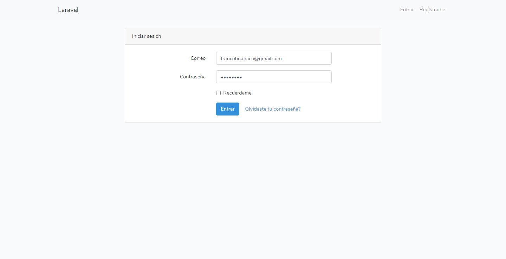
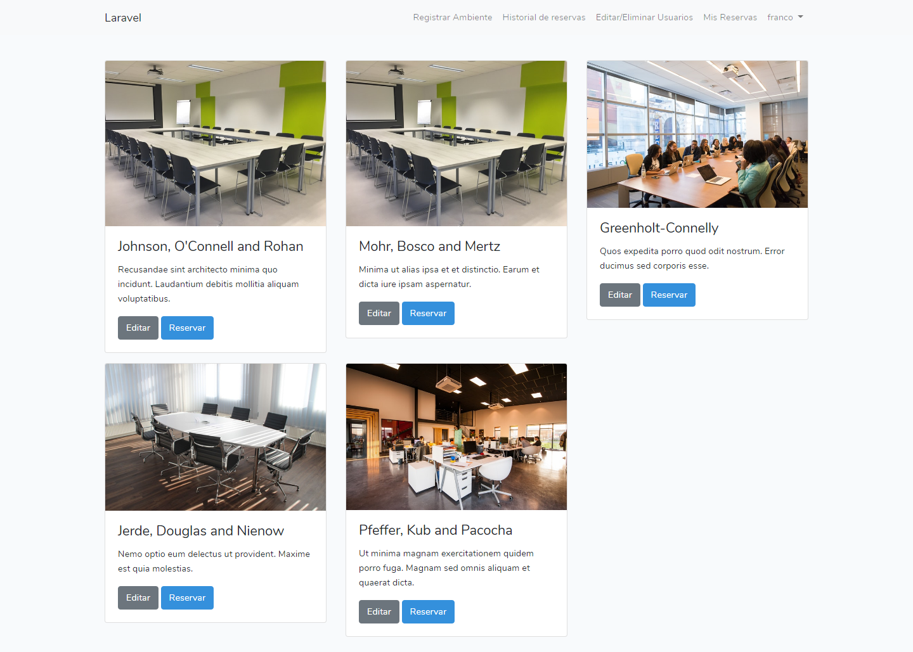
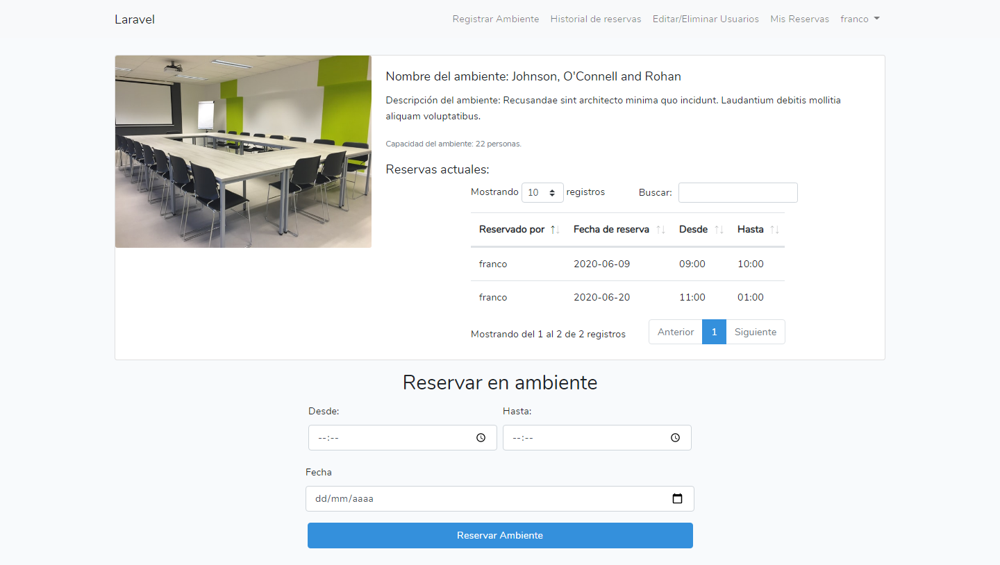
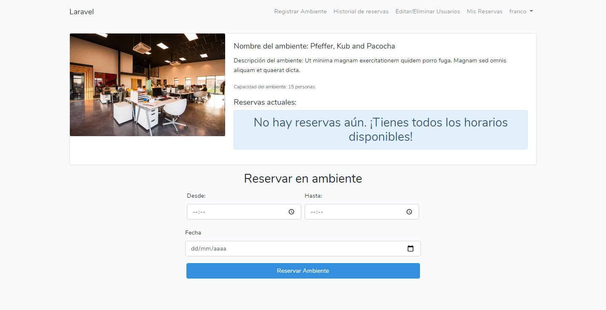
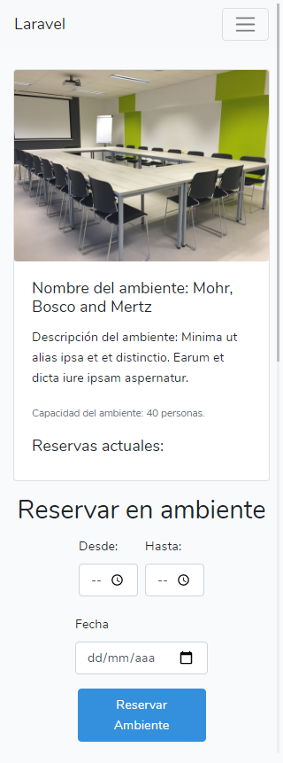
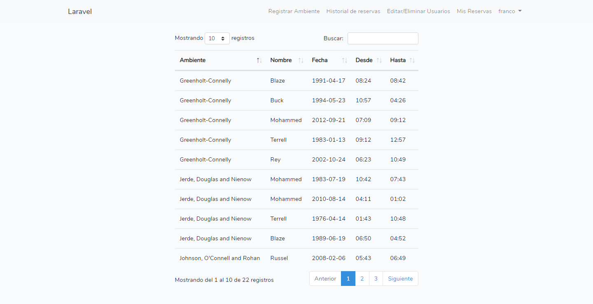

# RESERVA AMBIENTES

Sistema para gestionar los ambientes con los que se cuenta en las oficinas de la AGETIC en el marco del programa de voluntariado del área de investigación. Desarrollado principalmente con el Framework Backend Laravel, el motor de base de datos MySql y el framework Css Bootstrap 4, implementando el desarrollo con responsive design.

## Instrucciones:

1. Debes tener instalado PHP en tu equipo
2. Importante tener instalado composer para poder instalar las dependencias `https://getcomposer.org/`.
3. Montar el proyecto en el servidor local de su preferencia Xampp, Lampp, etc.
4. Instalar las dependencias del proyecto con `composer install`.
5. Para probar la App instalar las migraciones y seeds programadas con `php artisan --seed`.
6. Iniciar el proyecto en modo desarrollo con `php artisan serve`.
7. Ver el proyecto en `http://127.0.0.1:8000/`.
8. Para ingresar puede usar uno de los usuarios creados en las migraciones, o crear su propio usuario en la seccion de login.

